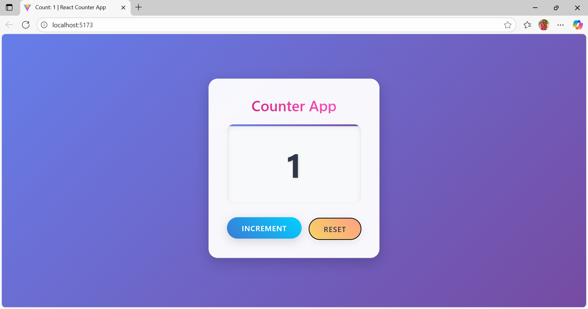
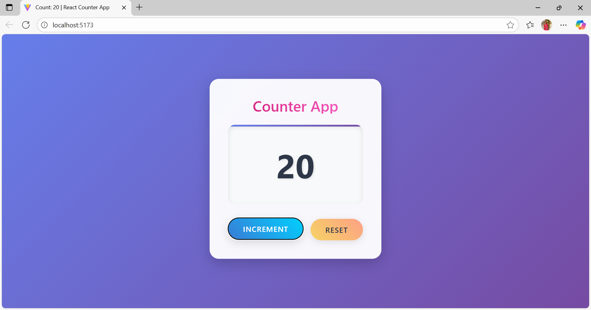

# React useEffect Counter Project

🚀 This is a simple React project demonstrating the use of **useEffect** and **useState** hooks.  
The app dynamically updates the **page title** with the counter value and displays it on the page.  

---

## 📌 Features
- ➕ Increase counter value by clicking the button  
- 🔄 Updates **document title** automatically using `useEffect`
- 🔁 Reset counter value to 1 using Reset button 
- 🖥️ Displays updated counter value on the page  

---

## 📸 Output Screenshots

###
  

###
  

## 🛠️ Tech Stack
- **React (Vite)**
- **JavaScript (ES6+)**
- **CSS** for basic styling  

---

## ▶️ How to Run
```bash
# Clone the repository
git clone https://github.com/tgmonisha/react_UseEffectCounter.git

# Navigate into the project folder
cd react_UseEffectCounter

# Install dependencies
npm install

# Start development server
npm run dev
